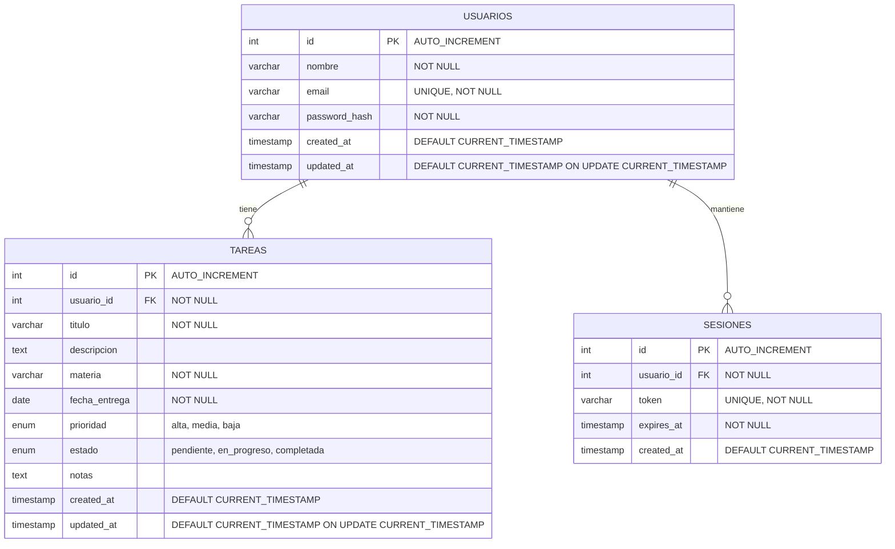

# Diagrama Entidad-Relación - Gestor de Tareas Académicas

## Diagrama ER

## Descripción de las Entidades

### USUARIOS
- **Propósito**: Almacena la información de los usuarios del sistema
- **Campos principales**:
  - `id`: Identificador único del usuario
  - `nombre`: Nombre completo del usuario
  - `email`: Correo electrónico único para login
  - `password_hash`: Contraseña cifrada con bcrypt
  - `created_at`, `updated_at`: Timestamps de auditoría

### TAREAS (Entidad Principal)
- **Propósito**: Almacena las tareas académicas de cada usuario
- **Campos principales**:
  - `id`: Identificador único de la tarea
  - `usuario_id`: Referencia al usuario propietario
  - `titulo`: Título descriptivo de la tarea
  - `descripcion`: Descripción detallada de la tarea
  - `materia`: Asignatura o materia académica
  - `fecha_entrega`: Fecha límite para completar la tarea
  - `prioridad`: Nivel de prioridad (alta, media, baja)
  - `estado`: Estado actual de la tarea
  - `notas`: Notas adicionales del usuario

### SESIONES
- **Propósito**: Maneja las sesiones activas de los usuarios
- **Campos principales**:
  - `id`: Identificador único de la sesión
  - `usuario_id`: Referencia al usuario
  - `token`: Token único de sesión
  - `expires_at`: Fecha de expiración del token

## Relaciones

1. **USUARIOS → TAREAS (1:N)**
   - Un usuario puede tener múltiples tareas
   - Cada tarea pertenece a un solo usuario

2. **USUARIOS → SESIONES (1:N)**
   - Un usuario puede tener múltiples sesiones activas
   - Cada sesión pertenece a un solo usuario

## Índices Recomendados

- `usuarios.email` (UNIQUE)
- `tareas.usuario_id` (INDEX)
- `tareas.fecha_entrega` (INDEX)
- `tareas.estado` (INDEX)
- `sesiones.token` (UNIQUE)
- `sesiones.usuario_id` (INDEX)
