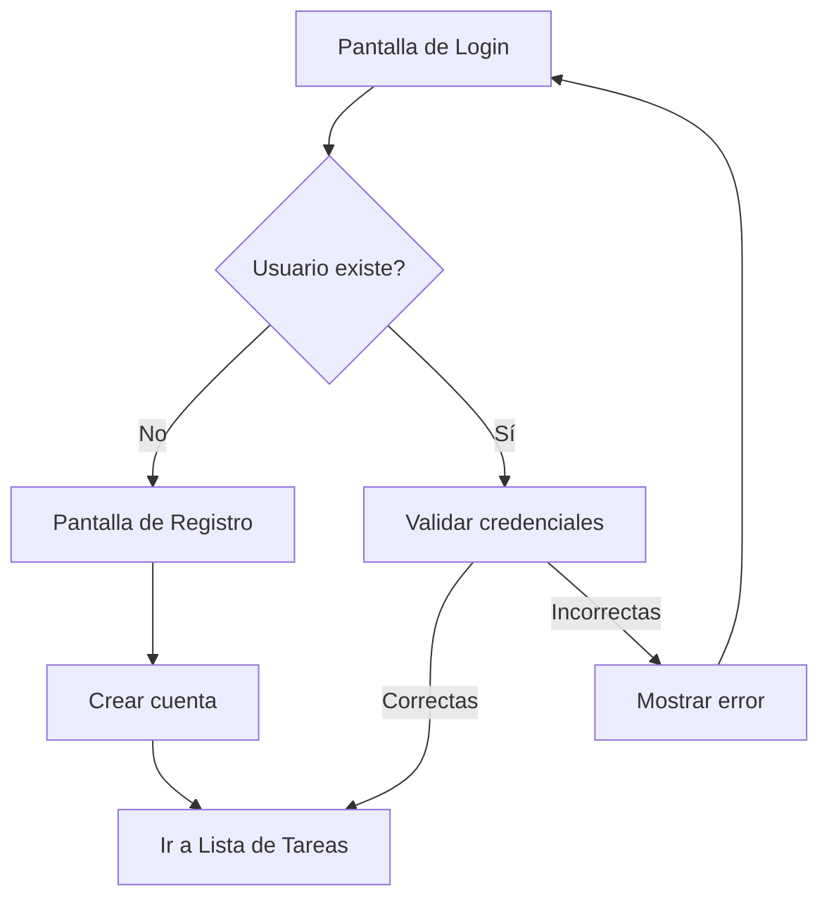
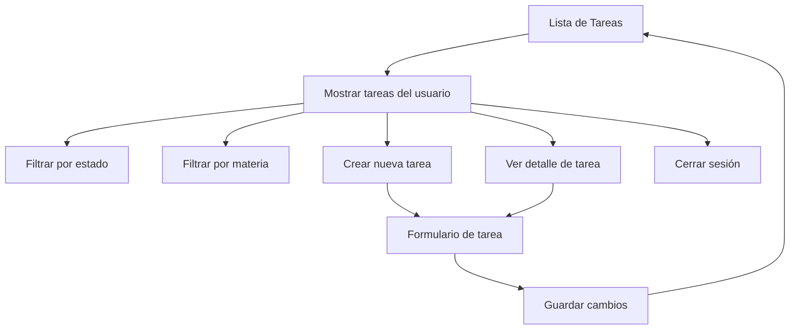
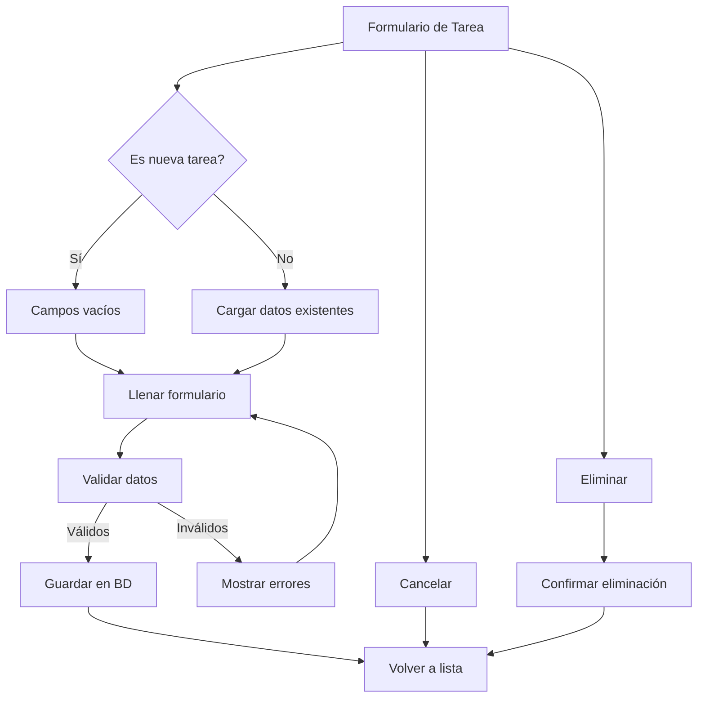
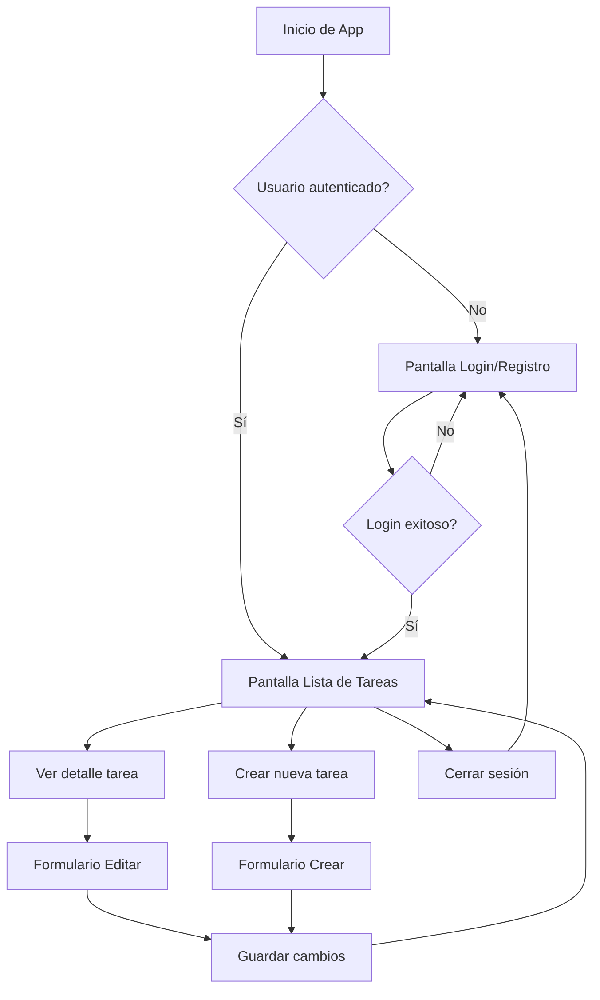

# Bocetos de Pantallas - Gestor de Tareas Académicas

## Pantalla 1: Autenticación (Login/Registro)



### Diseño de Login:
```
┌─────────────────────────────────┐
│        📚 Gestor de Tareas      │
│                                 │
│  ┌─────────────────────────────┐ │
│  │ Email: [________________]  │ │
│  └─────────────────────────────┘ │
│                                 │
│  ┌─────────────────────────────┐ │
│  │ Contraseña: [____________]  │ │
│  └─────────────────────────────┘ │
│                                 │
│  ┌─────────────────────────────┐ │
│  │        INICIAR SESIÓN       │ │
│  └─────────────────────────────┘ │
│                                 │
│  ┌─────────────────────────────┐ │
│  │     ¿No tienes cuenta?      │ │
│  │        REGISTRARSE          │ │
│  └─────────────────────────────┘ │
└─────────────────────────────────┘
```

### Diseño de Registro:
```
┌─────────────────────────────────┐
│        📚 Gestor de Tareas      │
│                                 │
│  ┌─────────────────────────────┐ │
│  │ Nombre: [________________] │ │
│  └─────────────────────────────┘ │
│                                 │
│  ┌─────────────────────────────┐ │
│  │ Email: [________________]  │ │
│  └─────────────────────────────┘ │
│                                 │
│  ┌─────────────────────────────┐ │
│  │ Contraseña: [____________]  │ │
│  └─────────────────────────────┘ │
│                                 │
│  ┌─────────────────────────────┐ │
│  │ Confirmar: [____________]   │ │
│  └─────────────────────────────┘ │
│                                 │
│  ┌─────────────────────────────┐ │
│  │        REGISTRARSE          │ │
│  └─────────────────────────────┘ │
│                                 │
│  ┌─────────────────────────────┐ │
│  │     ¿Ya tienes cuenta?      │ │
│  │        INICIAR SESIÓN       │ │
│  └─────────────────────────────┘ │
└─────────────────────────────────┘
```

## Pantalla 2: Lista de Tareas



### Diseño de Lista de Tareas:
```
┌─────────────────────────────────┐
│ 📚 Gestor de Tareas    👤 Juan  │
│                                 │
│ ┌─────────────────────────────┐ │
│ │ 🔍 Buscar tareas...        │ │
│ └─────────────────────────────┘ │
│                                 │
│ ┌─────────────────────────────┐ │
│ │ 📋 Filtros:                │ │
│ │ [Todos] [Pendientes] [En   │ │
│ │  Progreso] [Completadas]   │ │
│ └─────────────────────────────┘ │
│                                 │
│ ┌─────────────────────────────┐ │
│ │ 🔴 Proyecto Final           │ │
│ │    Programación Móvil       │ │
│ │    📅 15 Dic 2024          │ │
│ │    🔥 Alta prioridad       │ │
│ └─────────────────────────────┘ │
│                                 │
│ ┌─────────────────────────────┐ │
│ │ 🟡 Ensayo IA               │ │
│ │    Inteligencia Artificial  │ │
│ │    📅 10 Dic 2024          │ │
│ │    ⚡ Media prioridad       │ │
│ └─────────────────────────────┘ │
│                                 │
│ ┌─────────────────────────────┐ │
│ │ 🟢 Laboratorio Redes        │ │
│ │    Redes de Computadores    │ │
│ │    📅 08 Dic 2024          │ │
│ │    ✅ Completada           │ │
│ └─────────────────────────────┘ │
│                                 │
│                    ┌─────────┐  │
│                    │    +    │  │
│                    └─────────┘  │
└─────────────────────────────────┘
```

## Pantalla 3: Detalle/Formulario de Tarea



### Diseño de Formulario de Tarea:
```
┌─────────────────────────────────┐
│ ← Nueva Tarea / Editar Tarea    │
│                                 │
│ ┌─────────────────────────────┐ │
│ │ Título: [________________] │ │
│ └─────────────────────────────┘ │
│                                 │
│ ┌─────────────────────────────┐ │
│ │ Descripción:               │ │
│ │ [________________________] │ │
│ │ [________________________] │ │
│ │ [________________________] │ │
│ └─────────────────────────────┘ │
│                                 │
│ ┌─────────────────────────────┐ │
│ │ Materia: [________________] │ │
│ └─────────────────────────────┘ │
│                                 │
│ ┌─────────────────────────────┐ │
│ │ Fecha entrega: [__________] │ │
│ └─────────────────────────────┘ │
│                                 │
│ ┌─────────────────────────────┐ │
│ │ Prioridad: [Alta ▼]        │ │
│ └─────────────────────────────┘ │
│                                 │
│ ┌─────────────────────────────┐ │
│ │ Estado: [En Progreso ▼]     │ │
│ └─────────────────────────────┘ │
│                                 │
│ ┌─────────────────────────────┐ │
│ │ Notas adicionales:          │ │
│ │ [________________________] │ │
│ │ [________________________] │ │
│ └─────────────────────────────┘ │
│                                 │
│ ┌─────────┐ ┌─────────┐ ┌─────┐ │
│ │ GUARDAR │ │CANCELAR │ │DEL │ │
│ └─────────┘ └─────────┘ └─────┘ │
└─────────────────────────────────┘
```

## Flujo de Navegación General



## Características de Diseño

### Colores y Iconos:
- 🔴 Rojo: Alta prioridad
- 🟡 Amarillo: Media prioridad  
- 🟢 Verde: Baja prioridad / Completada
- 📚 Icono principal de la app
- 👤 Icono de usuario
- 📅 Icono de fecha
- ✅ Icono de completado
- 🔥 Icono de alta prioridad
- ⚡ Icono de media prioridad

### Estados de Tareas:
- **Pendiente**: Tarea creada pero no iniciada
- **En Progreso**: Tarea en desarrollo
- **Completada**: Tarea finalizada

### Prioridades:
- **Alta**: Tareas urgentes o importantes
- **Media**: Tareas normales
- **Baja**: Tareas que pueden esperar
